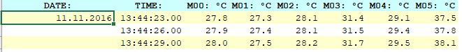
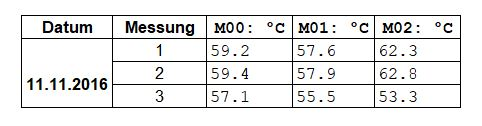
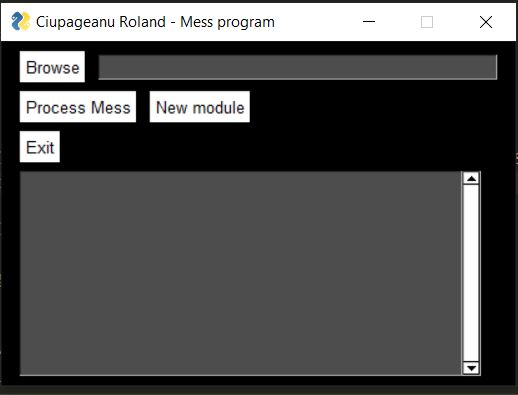
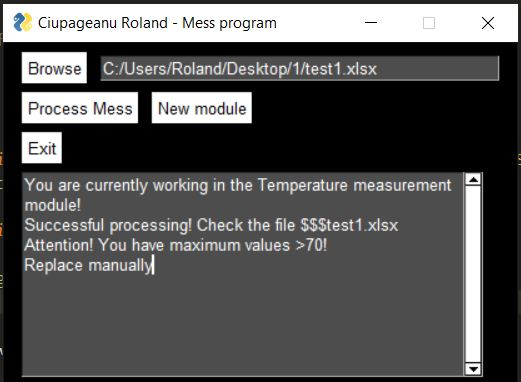

# Project name: Mess
### A simple desktop program that manages temperature measurements in excel format.

### Video Demo:  <https://www.youtube.com/watch?v=xIuoZE-CCPc>
### 1. Project description and motivation:

In my daily work as an engineer in the automotive industry, I often encounter tasks that are repetitive, they take a long time, and are frustrating, but they still have to be done. There is a lot of work to be done especially with files excel type. Of course, various tools and advanced systems are used to process data, but at the end of the day everyone needs an excel file: parts to do, tasks, open points, even datasheets of different products, all result in an excel like type.

This program automates and solves one of these tasks, being used by me and other colleagues
in the company where I work at the moment. It is the first program written by me that has practical utility.

During the adjustments made in production, temperatures are measured using a measuring device.
Depending on how the device is set, it records the temperature every 5 or 3 seconds (or even less)
at various points. Several such measurements are made (usually between 3 and 5 measurements are made, but in rare cases 50 measurements end up being made, when the machine's capability is tested).

At the end of the measurement process, an excel file is exported from the mesuring device, which contains hundreds of lines containing data in the format:

Where: 
- "DATE:" is the date on which the measurement was made
- "TIME:" holds the exact time for the set of measurements (every X seconds)
-  M00 ... M05 are the measuring points, containing the measured temperature at a certain moment

**Important note:** Between two "DATE" values stands the first measurement, the second measurement stands between the second and the third, and so on. In this way, the delimitation of the measurements is done.

### 2. What problems does it solve? :
The excel file (containing the exported measurements) must be further processed so that it's modified/ formated in a certain way and following some rules.
Based on the processed file results a table that contains the maximum value for each point for each measurement.
For example, at 3 points with 3 measurements, we will have to have 9 maximum values (3 for each point).

Example of resulting table for a file containing maximum values from 3 points with 3 measurements:

 
#### Logic behind the result, what needs to be done to the file:

**We must find:**
- The number of measurement points 
- The number of measurements 
- The maximum value must be found on each point, on each measurement. 

- If there are points where we have values higher than 70 degrees, they must be replaced with the value of a point from the neighborhood to which we add 0.9
- If we have missing values or "-", they must be replaced with the value of a nearby point to which we add 0.9

**Special cases to deal with:**
- If we have only one measurement point and there are values to be replaced, the values can not be replaced, because there is no neighboring point from which we can take the value and modify (in this case the user must be notified that the processed file contains only one point and values >70 and/ or "-" values. )

- If after processing the file still contains values >70 or "-" (in this case the user must be notified that the processed file still contains these types of values)

If all the above conditions have been met, we go further with the processing of the file.
In the same directory as the file to process, we will get a new file with two resulting sheets:
- One sheet containing the table of temperatures (modified following the above logic)
- One sheet containing the table of maximum values (described in above)

The resulting modified file will have the same name as the original file, and it will have a mark of "$$$" in front of the file name.

**Example:**
File to process: test.xlsx
Resulting file: $$$test.xlsx

### 2. How did I made the program :

To automate these tasks I used Python3 together with the libraries: Pandas, Numpy and PySimpleGUI for the GUI interface. Pandas is a library used for data manipulation. A characteristic data structure of this library is a Dataframe, which it's a 2D structure, arranged in a tabular form that contains: lines, columns and data.

**The basic idea:** in order to process the excel file, I created a Dataframe that I manipulated with the help of the Pandas and Numpy libraries. After processing, will result the modified dataframe and a new one containing the result . The two dataframes, (the processed one and the newly created one) are further saved in a new excel file. In the newly created excel file each dataframe will be saved in a new sheet.

##### The program was made by using the object orientated programming aproach, as follows:

The program is made out of two python files:
**mess.py** : In this file lyes the grafical user interface made in PySimpleGUI.
**mess_import_0.py** : In this file lyes the class "Mess". This class contains all the specific methods used for this type of file processing.

### 3. Requirements and usage :
**Requirements:**
- Windows operating system (I didn't test it on a MAC)
- Python3 with the libraries: Pandas, Numpy and PySimpleGUI
  (or the program converted into an exe file using py2exe)
- Microsoft excel

**Important notes:**
- The excel files to process must have the .xlsx extension. The old .xls files won't work.
- The program and files to process must be located in the same directory

**Usage:**
**In order to use the program, follow these instructions:**

- Copy the file that you want to process in the same folder as the program.
- Ensure that the file has the .xlsx extension.
- Ensure that while working, the xlsx target file is not opend!
- Open the mess.py file. After opening the program, you will see the following interface:

- Click on the "Browse" button in order to browse and select the file that you want to process and select it.
- Click on "Process Mess" in order to process the file.
- After clicking, if the file was successfully processed, you will see the message: 

"You are currently working in the Temperature measurement module!
Successful processing! Check the file $$$test.xlsx." (example on a test.xlsx file)

**Special note about the sown messages**
Depending of the file data, you can see other messages as well. The program will notice you if the processing could not be done or there is data that after processing you will need to modify manually (like when you have only one measurement point and after processing the file still contains "-" values or values above 70 degrees).

- After processing, you can find the result file in the same folder. The processed file will be named: "$$$FILENAME.xlsx". The original file will not be modified in any way so you can still check or use the original data anytime.

### 4. Challenges encountered along the way and lessons learned

**Challenges:**
Beside using my newly programming knolege to make something that is of use, to be more specific, the task that i've found to be a bit tricky was that I had to read the values from columns and then display them on the lines. In a mathematic approach that would be like inverting a matrix, but the problem was that in order to invert a matrix it needs to be of a square type (nr_rows == nr_columns) and this is not always applicable to my problem as the rows will not always be equal to the columns (example: The 1 point x 3 measurements ==> 3rows x 1 column).

**Lessons kearned:**
**OOP:** As I started with procedural programming first by learning the Python programming language, I've first made the program this way (procerural runing as a comand prompt program with no interface). After I've struggled with the OOP concepts by making exercices and reading, I realised that I understood better these concepts by applying them to something useful.

**Pandas:** Alltough i've bearly scratched the surface of this powerfull library, I tryed to understand it as much as possible. I know that maybe there are sympler ways to deal with excel files in Python. I've chose this path so that I can learn and apply something of use in the future.

### 5. Possible improvements
- **It would be possible to add more modules.** This program is used in the industrial engineering department but it could be used in other deparments as well. For example in logistics there are a lot of files and logic to process. These problems could be solved by adding another class in the mess_import_0.py file with specific methods (you can see in the interface that i've left a button called"New module", that will be the next module)

- **Processing speed could be improved.** At this stage my main goal was to solve the problem in therms of getting the job done by respecting the logic/ requirements but in further steps the program may be modified in order to run faster.

- **The whole program could be converted into a web app.** As the files are processed on desktop computers, I didn't bother solving the portability issue, but in order to run on other machines, I had to patch the scripts by using the PyToExe. The program could run on every macine with a browser by converting it to a web app.